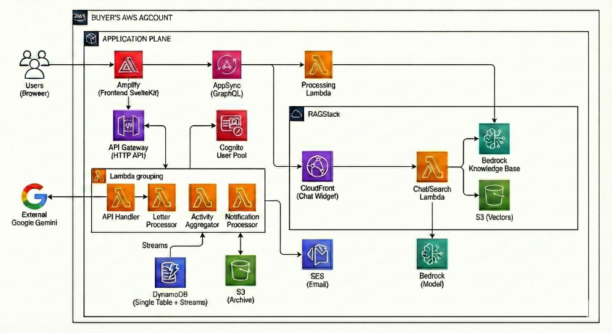

<p align="center">
<a href="https://github.com/HatmanStack/family-archive-document-ai/actions"></a>
<a href="https://www.apache.org/licenses/LICENSE-2.0.html"></a>
</p>

<p align="center">
<a href="https://kit.svelte.dev"></a>
<a href="https://svelte.dev"></a>
<a href="https://vitest.dev"></a>
<a href="https://docs.aws.amazon.com/lambda/"></a>
<a href="https://aws.amazon.com/dynamodb/"></a>
<a href="https://aws.amazon.com/cognito/"></a>
<a href="https://aws.amazon.com/s3/"></a>
</p>

<p align="center">
<b>Preserving family memories with AI</b>
</p>

A private family platform for sharing letters, photos, and memories. Upload scanned letters with AI-powered transcription, browse a shared media gallery, and engage with family content through comments and reactions.

<p align="center">
  <b>QUESTIONS?</b>
  <a href="https://deepwiki.com/HatmanStack/family-archive-document-ai/">
    <sub></sub>
  </a>
</p>

## Features

- **Letter Archive** - Upload scanned letters (PDF/images), AI transcription via Google Gemini
- **Media Gallery** - Photos, videos, and documents with categories and presigned URL access
- **Comments & Reactions** - Threaded comments on letters and media with like reactions
- **Direct Messaging** - Private conversations between family members with file attachments
- **User Profiles** - Customizable profiles with family relationships and activity history
- **Version History** - Track letter edits with full version history and revert capability
- **Rate Limiting** - Atomic DynamoDB-based rate limiting with fail-open behavior
- **RAGStack Integration** - Optional AI-powered semantic search and chat

## Quick Deploy

**Deploy to your AWS account in ~15 minutes:**

🚀 **[One-Click CloudFormation Deployment](https://us-east-1.console.aws.amazon.com/cloudformation/home?region=us-east-1#/stacks/quickcreate?templateURL=https://hold-that-thought-quicklaunch-public-631094035453.s3.us-east-1.amazonaws.com/hold-that-thought-template.yaml)**

📖 **[Step-by-Step Tutorial](docs/ONE_CLICK_DEPLOYMENT.md)** - Complete deployment guide

⚠️ **IMPORTANT:** After deployment, add users to the ApprovedUsers group:
```bash
aws cognito-idp admin-add-user-to-group \
  --user-pool-id YOUR_POOL_ID \
  --username user@example.com \
  --group-name ApprovedUsers
```

**Try it first:** [Live Demo](https://showcase-htt.hatstack.fun) (guest login available)

## Architecture



**Key Components:**
- **Frontend**: SvelteKit 2.x + Svelte 4, DaisyUI components, TailwindCSS
- **Backend**: Consolidated API Lambda with route-based handlers
- **Database**: DynamoDB single-table design with GSI for queries
- **Storage**: S3 with presigned URLs for secure media access
- **Auth**: Cognito User Pool with JWT tokens and user groups

## Local Development

### Prerequisites

- Node.js v24 LTS (via nvm)
- AWS CLI configured with credentials
- AWS SAM CLI for deployment

### Installation

```bash
# Clone and install
git clone https://github.com/HatmanStack/family-archive-document-ai.git
cd family-archive-document-ai
npm install
cd frontend && npm install && cd ..

# Deploy backend first
npm run deploy  # Interactive prompts for AWS configuration

# Configure frontend (uses outputs from deploy)
cd frontend
cp .env.example .env
# .env is auto-populated by deploy script

# Start development server
npm run dev
```

### Post-Deployment: Add Users to ApprovedUsers

**Required for app access:**

```bash
# Get User Pool ID from deploy outputs
aws cognito-idp admin-add-user-to-group \
  --user-pool-id YOUR_POOL_ID \
  --username your-email@example.com \
  --group-name ApprovedUsers \
  --region us-east-1
```

See [ONE_CLICK_DEPLOYMENT.md](docs/ONE_CLICK_DEPLOYMENT.md) for detailed setup.

## Project Structure

```
family-archive-document-ai/
├── frontend/                 # SvelteKit application
│   ├── routes/              # File-based routing
│   │   ├── auth/           # Login, signup, password reset
│   │   ├── gallery/        # Media gallery
│   │   ├── letters/        # Letter viewing and editing
│   │   ├── messages/       # Direct messaging
│   │   └── profile/        # User profiles
│   └── lib/
│       ├── auth/           # Cognito authentication
│       ├── components/     # Reusable Svelte components
│       ├── services/       # API service modules
│       └── types/          # TypeScript definitions
│
├── backend/                  # AWS SAM application
│   ├── template.yaml        # SAM infrastructure definition
│   └── lambdas/
│       ├── api/            # Consolidated REST API
│       │   └── src/
│       │       ├── routes/     # Route handlers
│       │       ├── lib/        # Shared utilities
│       │       └── types/      # TypeScript types
│       ├── letter-processor/   # PDF merge + Gemini AI
│       ├── activity-aggregator/# DynamoDB stream processor
│       └── notification-processor/ # Email notifications
│
├── tests/                    # Centralized test suites
│   ├── unit/                # Vitest unit tests
│   ├── integration/         # API integration tests
│   ├── e2e/                 # Playwright browser tests
│   └── load/                # Artillery load tests
│
└── docs/                     # Documentation
```

## Scripts

```bash
# Development
npm run dev                   # Start SvelteKit dev server
npm run build                 # Production build

# Testing
npm test                      # Run unit tests (Vitest)
npm run test:e2e              # Playwright E2E tests
npm run test:load             # Artillery load tests

# Quality
npm run lint                  # ESLint + type check
npm run check                 # Run all checks (lint + tests)

# Deployment
npm run deploy                # Deploy backend via SAM
```

## RAGStack Integration

RAGStack is deployed automatically as a nested CloudFormation stack, providing AI-powered search and chat. Environment variables are auto-configured.

**Features:**
- Chat widget for conversational search
- Semantic search across all indexed content
- Auto-indexing of letters, photos, videos, and documents

**Configuration:** See [RAGStack Integration Guide](docs/RAGSTACK_INTEGRATION.md)

## Documentation

**Getting Started:**
- [One-Click Deployment](docs/ONE_CLICK_DEPLOYMENT.md) - **Start here** - Deploy via CloudFormation template
- [Deployment Guide](docs/DEPLOYMENT.md) - Advanced deployment with `npm run deploy`
- [Troubleshooting](docs/TROUBLESHOOTING.md) - Common issues and solutions

**Technical Reference:**
- [Architecture](docs/ARCHITECTURE.md) - System design, components, data flows
- [Authentication](docs/AUTHENTICATION.md) - Cognito setup, user groups, JWT handling
- [API Reference](docs/API_REFERENCE.md) - REST API endpoints and examples
- [Data Model](docs/DATA_MODEL.md) - DynamoDB schema and access patterns
- [RAGStack Integration](docs/RAGSTACK_INTEGRATION.md) - Nested stack, semantic search, chat widget
- [Frontend Guide](docs/FRONTEND.md) - SvelteKit structure, services, components
- [Development](docs/DEVELOPMENT.md) - Local setup, testing, contributing

## License

Apache License 2.0
